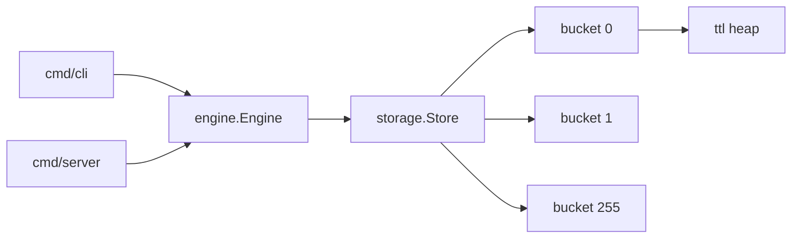

# kivo

An in-memory key-value store written in Go with sharded internal buckets, TTL expiry and approximated-LFU eviction for memory

## Features

- Get/Set/Delete/Exists with per-key TTL, Expire and Persist
- Sharded storage (256 buckets, hashed by keys) for concurrent access
- Auto memory-limit detection (defaults to 60% of host RAM) or a manual cap
- Frequency aware eviction when a bucket nears its memory limit
- Background sweeper toclear expired keys every minute
- CLI REPL and HTTP server both build on the same `engine` package

## Design



`Store` hashes each key to one of 256 `Bucket`. Each bucket holds its own map, TTL min-heap and eviction cursor guarded by its own mutex. When a bucket crosses its size threshold, `Set` evicts the least-frequently-used keys (scan, halving each key's frequency counter until one hits zero) untill the bucket is back is back under its target size


## Usage

```go
e, err := engine.New(ctx, engine.DefaultOpts())
if err != nil {
    log.Fatal(err)
}
err = e.Set("foo", []byte("bar"), 30*time.Second)
val, err := e.Get("foo")
```

```
go run ./cmd/cli
kivo> SET foo bar 30s
OK
kivo> GET foo
bar
```

```
go run ./cmd/server
# PORT env var, defaults to 8081
```

## CLI Commands

| Command                   | Description                                     |
| ------------------------- | ----------------------------------------------- |
| `SET <key> <value> [ttl]` | Store a value, optional TTL (`30s`, `5m`, `1h`) |
| `GET <key>`               | Retrieve a value                                |
| `DELETE <key>`            | Remove a key                                    |
| `EXISTS <key>`            | Check whether a key exists                      |
| `TTL <key>`               | Get remaining time-to-live                      |
| `EXPIRE <key> <ttl>`      | Update a key's expiration                       |
| `PERSIST <key>`           | Remove a key's expiration                       |
| `COUNT`                   | Get the total number of keys                    |
| `INFO`                    | Show store statistics                           |
| `FLUSH`                   | Remove all keys                                 |
| `HELP` / `EXIT` / `QUIT`  | Show help / exit the REPL                       |

## API HTTP

| Method & Path            | Description                            |
| ------------------------ | -------------------------------------- |
| `GET /ping`              | Health check                           |
| `PUT /kv/{key}`          | Body: `{"value": "...", "ttl": "30s"}` |
| `GET /kv/{key}`          | Fetch a value                          |
| `DELETE /kv/{key}`       | Remove a key                           |
| `GET /kv/{key}/exists`   | Check whether a key exists             |
| `GET /key/{key}/ttl`     | Get remaining TTL                      |
| `PUT /key/{key}/expire`  | Body: `{"ttl": "30s"}`                 |
| `PUT /key/{key}/persist` | Remove expiration                      |
| `GET /stats`             | Store statistics                       |

`ttl` fields are duration strings (`"30s"`, `"5m"`, `"1h"`) and plain numbers are rejected

## Limitations

- No persistence, all data is lost on restart
- No replication or clustering
- Eviction is per-bucket, not global. One hot bucket can evict while others sit under-utilized
- No auth or TLS on the HTTP server
